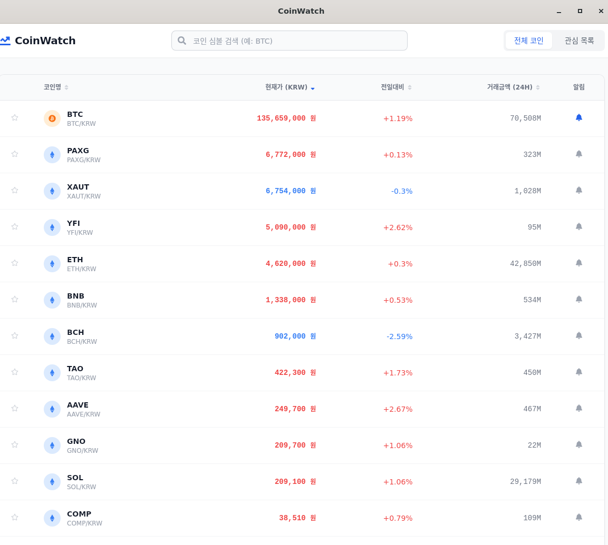
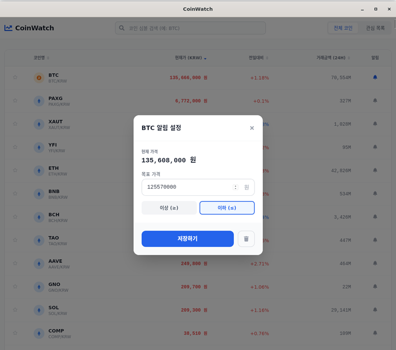

# CoinWatch 🪙
> 실시간 암호화폐 시세 모니터링 & 가격 알림 데스크탑 앱

**CoinWatch**는 빗썸(Bithumb) 거래소의 실시간 데이터를 기반으로, 빠르고 간편하게 코인 가격을 확인하고 원하는 가격에 알림을 받을 수 있는 모던한 데스크탑 애플리케이션입니다.




## ✨ 핵심 기능 (Key Features)

*   **📈 실시간 시세 조회**: 3초마다 자동으로 갱신되는 최신 가격 정보를 확인하세요.
*   **🔔 가격 알림 (Price Alert)**: 목표 가격을 설정하면 도달 시 데스크탑 푸시 알림을 보내드립니다.
*   **⭐ 관심 목록 (Watchlist)**: 자주 보는 코인만 별도로 모아서 관리할 수 있습니다.
*   **🔍 검색 및 정렬**: 원하는 코인을 빠르게 찾고, 거래대금/등락률 순으로 정렬해보세요.
*   **💻 멀티 플랫폼**: Windows, macOS, Linux 어디서든 동일한 경험을 제공합니다.

## 🚀 다운로드 및 설치 (Installation)

최신 버전(v0.1.0)은 **[Releases 페이지](https://github.com/ohyoulim/coin-watch/releases)**에서 다운로드할 수 있습니다.

### 🪟 Windows 사용자
1.  `CoinWatch_0.1.0_x64_en-US.msi` 또는 `.exe` 파일을 다운로드합니다.
2.  파일을 실행하여 설치를 진행합니다.
3.  *참고: 서명되지 않은 앱 경고(SmartScreen)가 뜰 경우, '추가 정보' -> '실행'을 클릭해 주세요.*

### 🍎 macOS 사용자
1.  `CoinWatch_0.1.0_aarch64.dmg` (Apple Silicon) 또는 `.dmg` 파일을 다운로드합니다.
2.  파일을 열고 CoinWatch 아이콘을 `Applications` 폴더로 드래그합니다.
3.  *참고: "확인되지 않은 개발자" 경고가 뜰 경우, '시스템 설정' > '개인정보 보호 및 보안'에서 '확인 없이 열기'를 클릭해야 할 수 있습니다.*

### 🐧 Linux (Ubuntu/Debian) 사용자
가장 간편한 `.deb` 파일을 추천합니다.

1.  `coin-watch_0.1.0_amd64.deb` 파일을 다운로드합니다.
2.  터미널을 열고 파일이 있는 폴더에서 아래 명령어를 실행합니다.
    ```bash
    sudo dpkg -i coin-watch_0.1.0_amd64.deb
    ```
3.  설치 후 앱 목록에서 'CoinWatch'를 찾아 실행합니다.

### 🐧 Linux (모든 배포판 - AppImage)
설치 없이 바로 실행하고 싶다면 `.AppImage`를 사용하세요.

1.  `coin-watch_0.1.0_amd64.AppImage` 파일을 다운로드합니다.
2.  실행 권한을 부여하고 실행합니다.
    ```bash
    chmod +x coin-watch_0.1.0_amd64.AppImage
    ./coin-watch_0.1.0_amd64.AppImage
    ```

## 🛠️ 기술 스택 (Tech Stack)

이 프로젝트는 최신 웹 기술과 Rust 기반의 경량화 프레임워크로 제작되었습니다.

*   **Frontend**: React, Vite
*   **Styling**: Tailwind CSS
*   **Desktop Engine**: [Tauri](https://tauri.app/) (Rust)
*   **API**: Bithumb Public API

## 👨‍💻 개발 및 빌드 방법 (Development)

소스 코드를 직접 수정하거나 빌드하고 싶다면 아래 절차를 따르세요.

```bash
# 1. 저장소 클론
git clone https://github.com/ohyoulim/coin-watch.git
cd coin-watch

# 2. 의존성 설치
npm install

# 3. 개발 모드 실행 (Web)
npm run dev

# 4. 데스크탑 앱 개발 모드 실행
npm run tauri dev

# 5. 프로덕션 빌드
npm run tauri build
```
